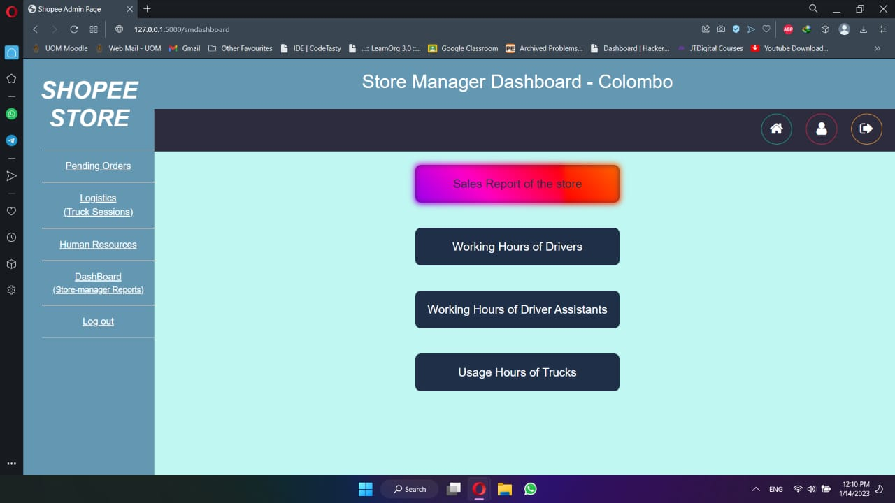
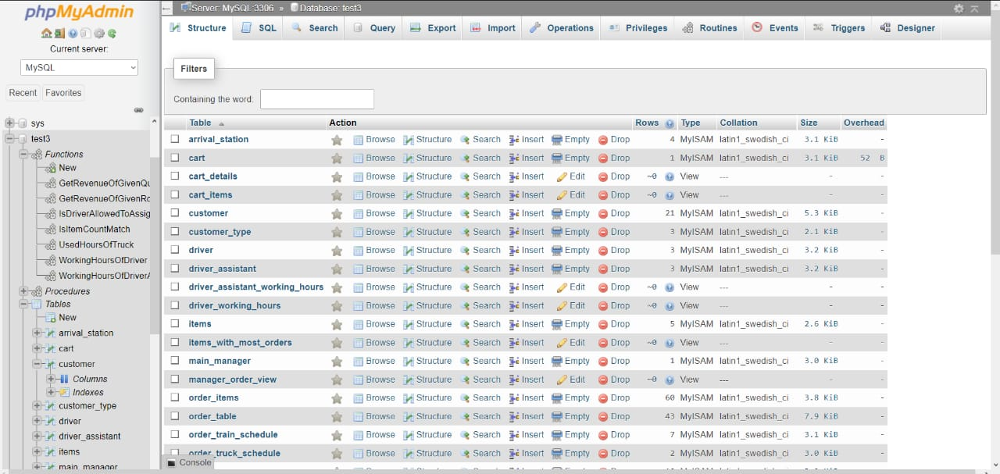
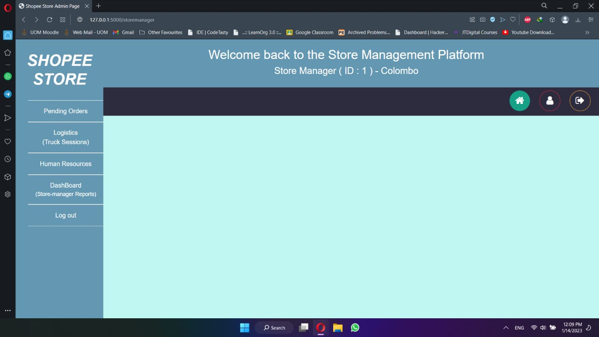

# Supply Chain Management System

A Supply Chain Management System developed to streamline and optimize supply chain processes. This application provides functionality for managing user accounts, tracking inventory, and ensuring efficient logistics.

---

## Features

- User authentication (login and registration).
- Interactive user interfaces for login and registration.
- Modular and scalable code structure.
- Designed with Database Efficiency in mind.

---

## Technologies Used

- **Backend**: Python, Flask  
- **Frontend**: HTML, CSS, Javascript  
- **Database**: MySQL  
- **Styling**: CSS  

---

## Visual Overview

Here are some images to showcase the Supply Chain Management System:

### 1. Application Overview

---

### 2. User Authentication Page

---

### 3. Database Efficiency Representation

---

## How to Use

1. Clone the repository to your local machine.  
2. Set up the virtual environment and install dependencies.  
3. Run `app.py` to launch the system.  
